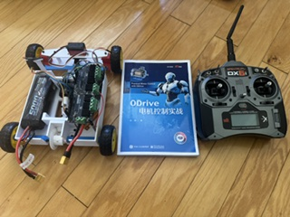
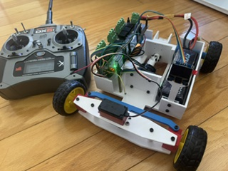
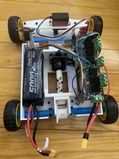
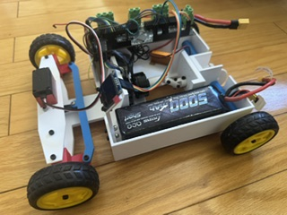

ODrive Motor Control in Practice

This repository contains the supporting materials for the book:

ODrive 电机控制实战

本仓库是《ODrive 电机控制实战》一书的配套资源仓库。

little car final project here 最后的小项目视频
[观看演示视频](3dprintmodel_demo_fromOdrivebook/videos/IMG_4448.mp4)

[click here to buy the book 点击购买《ODrive 电机控制实战》]([https://你的购买链接.com](https://mall.bilibili.com/neul-next/detailuniversal/detail.html?isMerchant=1&page=detailuniversal_detail&saleType=0&itemsId=40330749&loadingShow=1&noTitleBar=1&track_id=__BGMT__&from=&from_spmid=__SPMID__&msource=cps_comments_3546707220498944_cont-1-116022233268364))

The book has been officially published in China by Publishing House of Electronics Industry.

If you find this book or this repository helpful, please consider supporting the official published version. 
Your support helps me continue improving the materials and creating more practical content about motor control, 
robotics, embedded systems, and low-level engineering.

本书已由 电子工业出版社 在中国正式出版。如果这本书或本仓库中的内容对你有帮助，欢迎支持正版购买。
你的支持也是我继续更新资料、完善示例代码、制作更多电机控制与机器人相关内容的动力。

Book Official purchase links:
https://mall.bilibili.com/neul-next/detailuniversal/detail.html?isMerchant=1&page=detailuniversal_detail&saleType=0&itemsId=40330749&loadingShow=1&noTitleBar=1&track_id=__BGMT__&from=&from_spmid=__SPMID__&msource=cps_comments_3546707220498944_cont-1-116022233268364

图书正版购买链接：
👉 请在这里放购买链接 
https://mall.bilibili.com/neul-next/detailuniversal/detail.html?isMerchant=1&page=detailuniversal_detail&saleType=0&itemsId=40330749&loadingShow=1&noTitleBar=1&track_id=__BGMT__&from=&from_spmid=__SPMID__&msource=cps_comments_3546707220498944_cont-1-116022233268364

Repository Contents may include:
Source code
Example projects and 3d print parts
ODrive configuration files
Motor control experiments
Hardware connection notes
Debugging notes
Errata and updates
Additional resources not included in the printed book

本仓库包含的资源，你可以在本仓库中找到本书相关的配套资料，包括但不限于：
示例代码
最终实验项目以及3d打印文件
ODrive 配置说明
电机控制相关资料
调试记录
硬件连接参考
后续补充内容与勘误
如果你是按照书中的章节一步步学习，建议结合本仓库中的代码和说明一起实践。

Who This Book Is For
Engineers and students interested in ODrive motor control
Robotics enthusiasts and makers
Readers who want to understand BLDC motors, FOC, encoders, and motor drivers
Developers working on robots, mobile platforms, gimbals, or motion-control systems
Anyone who wants to learn motor control through hands-on practice

本书和本仓库适合以下读者：
想学习 ODrive 电机控制的工程师、学生和创客
想了解无刷电机、FOC、电机驱动和机器人底层控制的人
正在做机器人、小车、机械臂、云台或移动平台项目的人
希望从实际项目中理解电机控制的人

About the Book,This book focuses on practical ODrive motor control.
Instead of only explaining theory, the goal is to help readers build a real motor-control system step by step: wiring the hardware, 
configuring ODrive, tuning parameters, understanding feedback, and finally controlling the motor in real applications.
关于本书
《ODrive 电机控制实战》不是一本只讲理论公式的书，而是希望从实际工程出发，帮助读者真正把电机转起来、调起来、用起来。
本书围绕 ODrive 控制器展开，结合电机、编码器、电源、上位机配置、参数调试和实际控制过程，帮助读者建立对电机控制系统的整体理解。

Issues and Feedback
If you find any mistakes in the book or the repository, feel free to open an Issue or submit a Pull Request.
When reporting an issue, please include:
ODrive hardware version:
Firmware version:
Operating system:
Motor model:
Encoder model:
Error message:
Steps to reproduce:

资源说明,由于硬件版本、固件版本、操作系统环境和 ODrive 工具链可能会不断变化，本仓库中的内容可能会持续更新。
如果你在使用过程中发现问题，欢迎通过 GitHub Issues 提交反馈。
勘误与反馈
如果你发现书中或代码中存在错误，欢迎提交 Issue 或 Pull Request。
提交问题时，建议包含以下信息：
1. 使用的 ODrive 硬件版本
2. 使用的固件版本
3. 操作系统环境
4. 电机和编码器型号
5. 具体错误信息或现象
6. 你已经尝试过的解决方法

这样可以更快定位问题。

Support the Official Book
The book has been officially published by Publishing House of Electronics Industry in China.
If this project helps you, please support the official version.

Thank you!

支持正版
本书已经由 电子工业出版社 正式出版。
如果你希望系统学习 ODrive、电机控制、FOC 和机器人底层控制，欢迎购买正版图书。

正版购买链接：
👉 https://mall.bilibili.com/neul-next/detailuniversal/detail.html?isMerchant=1&page=detailuniversal_detail&saleType=0&itemsId=40330749&loadingShow=1&noTitleBar=1&track_id=__BGMT__&from=&from_spmid=__SPMID__&msource=cps_comments_3546707220498944_cont-1-114170229950178
感谢你的支持！

Author
Min Zhang / 张闽
I write and build projects about motor control, robotics, embedded systems, operating systems, and low-level software engineering.
作者：张闽
我长期关注电机控制、嵌入式系统、机器人、操作系统和底层软件技术，也会持续分享相关学习资料和项目实践。
欢迎关注我的其他内容：
个人主页：
B站：https://space.bilibili.com/3546707220498944?spm_id_from=333.788.0.0
Udemy：https://www.udemy.com/course/build-an-300-lines-operating-system-from-scratch-x86-base/?srsltid=AfmBOoqO5J6iv48X69rzoXLj_p0Y6hdH9ts34JwrYguhg-4mV1PZRxmn#instructor-1
GitHub：https://github.com/embedded-idea
